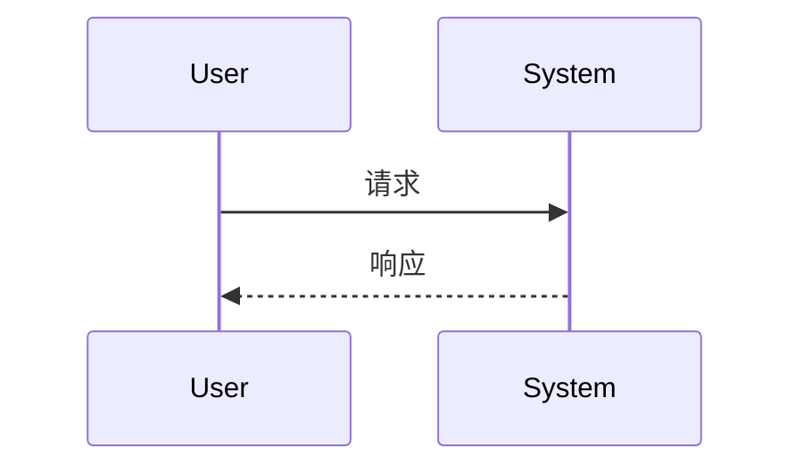

# REQ-001: 右键监控文件 - Monitor with ftail

> Type: requirement | Created: 2026-05-02

## 描述

<!-- 详细描述这个需求 -->

## 验收条件

- [ ] 条件1
- [ ] 条件2
- [ ] 条件3

## 设计

<!-- 用 mermaid/plantuml 描述流程和设计 -->

## 备注

<!-- 依赖、风险、相关文档 -->

